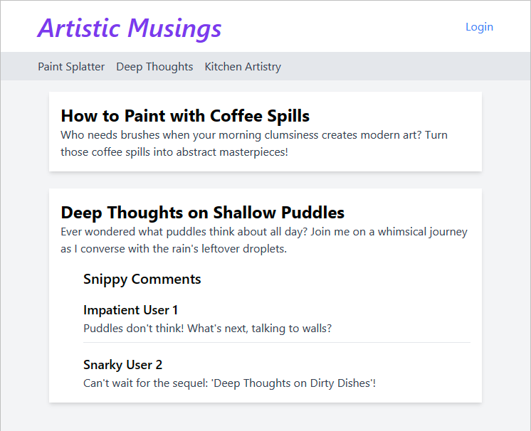

# Tailzample: a Tailwind example

This is an example of the type of CSS GPT4 can generate mid 2023. Maybe one day it will be able to make UI work a breeze. I'm sure it would break down given a more comprehensive project to modify, but doing this with a fairly simple verbal prompt is a start.

This content has no human input and thus is not subject to any license. It is generated by GPT4, which is subject to the [OpenAI API Terms of Service](https://beta.openai.com/terms-of-service).